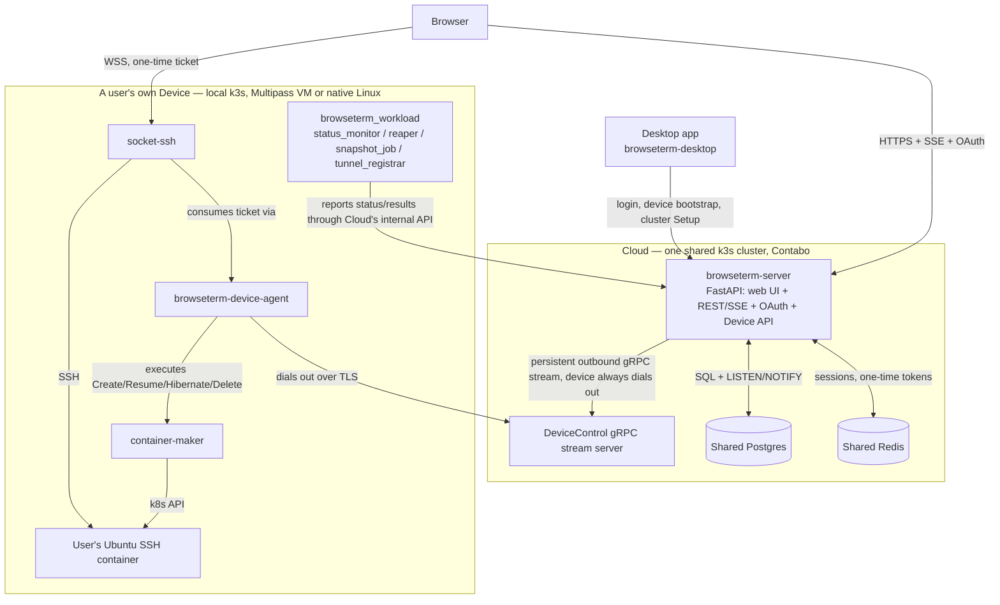

# BrowseTerm

BrowseTerm lets a user run Linux terminals (containers) in the browser, backed by **their own
registered machine** as compute — Cloud only ever holds account/device/container *metadata*, it
never runs a user's workload itself. A user logs in (Google/GitHub OAuth), registers a device
(their own Mac or Linux box), spins up an Ubuntu container on that device's own local Kubernetes
cluster, and gets an interactive SSH terminal streamed to the browser over a WebSocket. Containers
can be **saved** (snapshotted into a pushable Docker image) and **resumed** later, including on a
different device.

This repository is the **umbrella / table of contents** for the project: it aggregates every other
BrowseTerm repo as a git submodule and holds the cross-repo design docs. It has no code or
deployment of its own to run — each submodule deploys itself; see "Setting it up" below for where
that actually happens.

## Architecture



**Cloud never dials into a device — a device always dials out to Cloud**, one persistent
bidirectional gRPC stream per device. See `../puhtaeto_infra/cluster/k3s/device_cloud_grpc_connectivity.md`
for exactly how that connection is exposed and kept alive through Traefik.

## The repositories

| Repo | Role |
|---|---|
| **browseterm-server** | Cloud control plane. FastAPI: the web UI, REST/SSE API, sole Google/GitHub OAuth authority, the Device API, and the DeviceControl gRPC server devices connect to. |
| **browseterm-desktop** | The native macOS tray app users install. Login, device registration/bootstrap, and the "Setup" flow that provisions a device's own local k3s cluster (Multipass VM). Also ships a headless Linux CLI for the same Setup flow. |
| **browseterm-device-agent** | Runs inside a device's own local cluster. Holds the durable command journal, dials Cloud's gRPC stream, executes lifecycle commands (Create/Delete/Hibernate/Resume) via container-maker. |
| **browseterm-device-control-spec** | Protobuf contract for the Device↔Cloud gRPC stream (`DeviceControl.Connect`). |
| **container-maker** | gRPC service that turns a lifecycle command into real Kubernetes objects (pod/service/ingress) on the device's own cluster. |
| **container-maker-spec** | Protobuf contract between Device Agent (client) and container-maker (server). |
| **browseterm_workload** | Background/platform components deployed on a device's cluster: `status_monitor` (central pod-status watcher), `reaper` (idle-hibernate), `snapshot_job` (builds/pushes a save), `tunnel_registrar` (keeps the device's public tunnel URL registered with Cloud), `cert-manager` (mints internal mTLS certs). |
| **socket-ssh** | The WebSocket↔SSH bridge users' terminal sessions actually stream through. |
| **browseterm-dockerfiles** | The image that runs *inside* a user's own pod — the Ubuntu SSH container. |
| **browseterm-db** | Shared SQLAlchemy models, CRUD ops, Alembic migrations, the Postgres LISTEN/NOTIFY listener. Used by Cloud only. |
| **browseterm-storage** | Storage abstraction for container filesystem snapshots (local PVC or MinIO). Used by container-maker and `snapshot_job`. |
| **browseterm-marketing** | The public marketing/install site, a separate static Cloudflare Workers deployment — not part of the application itself. |

Every one of the above is a git submodule of this repo (see `.gitmodules`). Each has its own
README with its own setup/dev/test instructions — this file only covers the cross-repo picture.

## Setting it up

This repo has no deploy of its own to run - bring up the pieces in this order:

1. **Cluster(s) and shared databases: [`puhtaeto_infra`](https://github.com/Zim95/puhtaeto_infra).**
   BrowseTerm doesn't stand up its own Kubernetes cluster or its own Postgres/Redis instance -
   both are shared infrastructure that also backs other Puhtaeto projects (ikompare today).
   Whether you're standing up Cloud (a single-node k3s cluster) or a Device's own local cluster,
   start there: `cluster/k3s/` (or `cluster/docker-desktop/`, `cluster/k3d/` for local dev) for the
   cluster itself, `databases/` for the shared Postgres/Redis.
2. **Cloud** - deploy `browseterm-server` onto a cluster from step 1 (see that repo's own README
   for its `infra/cloud/` manifests and setup scripts). This is already running in production on
   Contabo; you'd only redo this step to stand up a new Cloud environment.
3. **A device** - install `browseterm-desktop` and use its Setup flow (or the headless Linux CLI
   equivalent) to provision a device's own local cluster and deploy `browseterm-device-agent`,
   `container-maker`, `socket-ssh`, and `browseterm_workload` onto it automatically. See
   `browseterm-desktop`'s own README.

## Design/history docs kept here

- **`OBSERVABILITY.md`** - the plan for making Grafana/Loki the debugger for failures across every
  service, instead of hand-reconstructing an incident from `kubectl logs`. Not yet built - this is
  the next thing being worked on.
- **`network_policies.md`** - the per-tenant NetworkPolicy isolation design for the untrusted `root`
  shells BrowseTerm runs.
- **`progress_made.md`** - this repo's own historical session log (through 2026-09-22). Superseded
  as the *active* log by `~/browseterm/progress_made.md` in the main workspace - kept here only as
  historical reference, not maintained further.
- **`01_language_detection/`** - a non-product utility (`make detect_language`) that generates
  dummy per-language files so GitHub's language stats reflect the codebase's real language mix,
  submodules included. Unrelated to the application itself.

The authoritative, actively-maintained design/progress docs for the current architecture
(the Cloud/Device split, the gRPC control plane, every migration Part) live one level up, in the
main workspace: `BROWSETERM_CLOUD_CONTROL_PLANE_MIGRATION.md`, `BROWSETERM_MIGRATION_PROGRESS.md`,
and `progress_made.md`.

## Getting started

```bash
git clone --recurse-submodules https://github.com/Zim95/browseterm-monorepo
```

If you forget `--recurse-submodules`:

```bash
git submodule update --init --recursive
```
